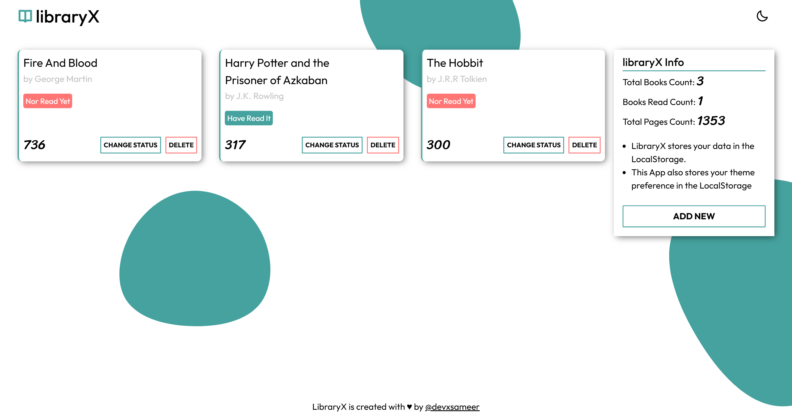
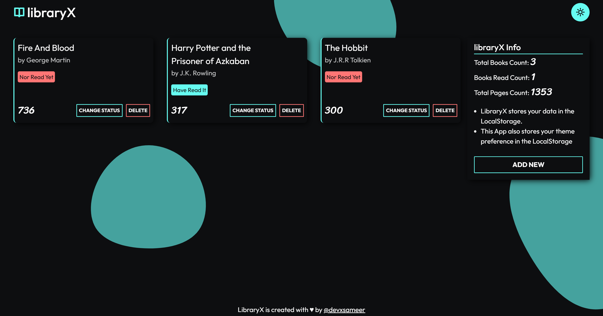

# 📚 LibraryX

A stylish, minimal **JavaScript book library app** that lets you track your reading list — complete with **light & dark mode**, **localStorage support**, and a sleek UI.

This project is part of **The Odin Project** JavaScript curriculum — enhanced with some ✨ personal creativity ✨.

---

## 🌐 Live Demo

🔗 [Check it out here](https://devxsameer.github.io/libraryx/)  
📦 [GitHub Repo](https://github.com/devxsameer/libraryx)

---

## 🖼️ Screenshots

### 🌞 Light Mode

### 🌙 Dark Mode

> _Bonus: Theme preference is saved!_ ☕️

---

## 🧩 Features

- ➕ **Add books** with:
  - Title
  - Author
  - Page count
  - Reading status
- 🔁 **Toggle reading status**
- 🗑️ **Delete books**
- 🌗 **Dark/Light theme toggle** (with localStorage)
- 💾 **Persistent data** — book list and theme are saved locally
- 🧼 Clean, responsive layout using CSS Grid & Flexbox

---

## 🛠️ Tech Stack

- HTML5
- CSS3 (custom properties + responsive layout)
- JavaScript (ES6+)
  - Object constructors & prototypes
  - LocalStorage API
  - DOM manipulation

---

## 🧠 What I Learned

- Applied **object constructors** and **prototypes** to model books
- Managed a dynamic array of book objects in memory and in localStorage
- Implemented user interactions with form validation and event listeners
- Practiced modular JS structure for better readability and reuse
- Used `localStorage` to persist both data and UI preferences
- Built a theme toggle system with CSS variables and JS sync

---

## 💬 Final Thoughts

LibraryX might not track your overdue fees...  
...but it definitely tracks your frontend progress.

#100DaysOfCode #JavaScript #TheOdinProject #LibraryApp #Frontend #WebDev #DarkMode #localStorage
